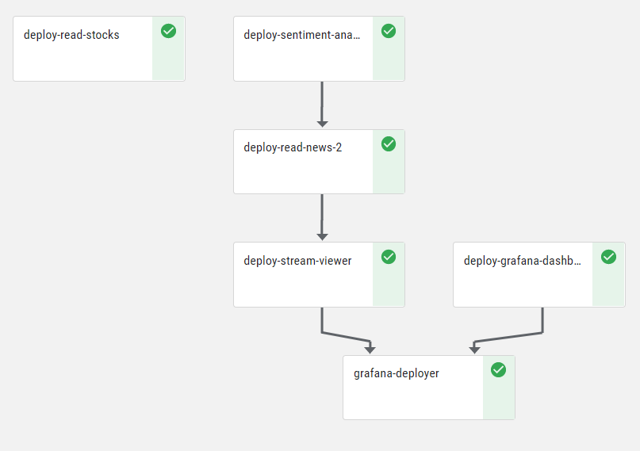
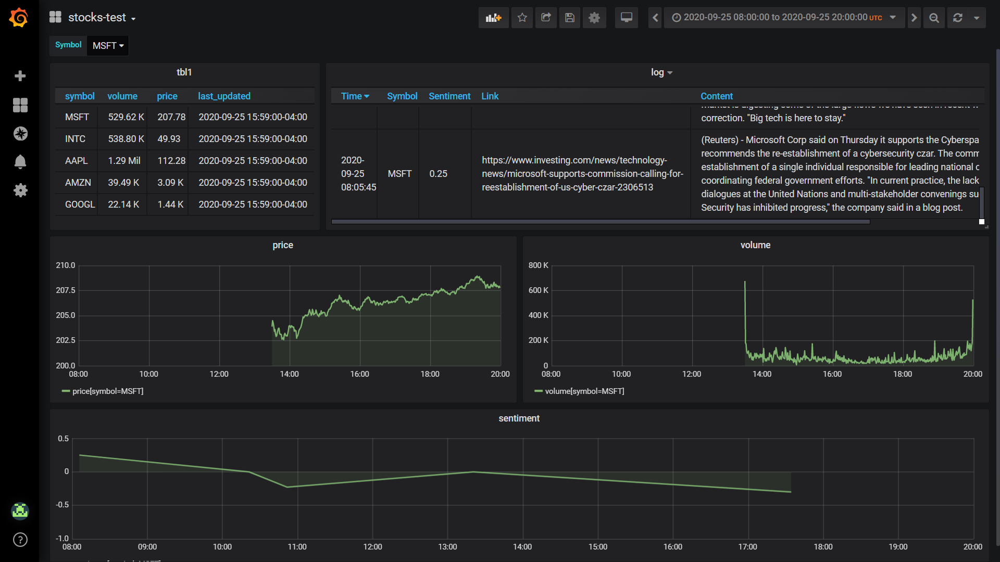
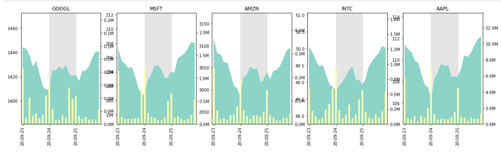

# Stocks Demo

A common requirement is to run your data engineering pipeline as part of the serving. This is often done by reading data from external data sources and generating insights using machine learning models.


This demo reads stock data, analyzes the related market news, and displays a dashboard of the data. In this demo we show how to:

1. Train a sentiment analysis model using BERT and deploy the model.
2. Deploying Python code to a scalable function (using Nuclio).
3. Integrate with Iguazio’s Real-Time Multi-Model Data Layer (time-series and key-value storage).
4. Leverage machine-learning to generate insights.
5. Process streaming data to a user friendly dashboard.

The demo flow is as follows:


## Prerequisites
This demo is pre-configured to run on the Iguazio Data Science Platform.

Make sure your conda environment has MLRun installed. You can install MLRun by running:

``` sh
python -m pip install mlrun
```

Also ensure that you have a Grafana service named `grafana`. You can add a new service in the Services tab of your Iguazio Data Science Platform UI. If you need permissions to create or access the Grafana dashboard, contact your system administrator.

## Quick-Start

To run the demo:

1. Open and run [**00-deploy-sentiment-model.ipynb**](code/00-deploy-sentiment-model.ipynb) to deploy the pre-computed sentiment analysis model
2. Open and run [**project.ipynb**](project.ipynb) to run the pipeline.

This will create a pipeline as displayed below:



The output of this pipeline is available in the Grafana dashboard as follows:



You can review the output using the [explore notebook](code/05-explore.ipynb) using Spark and Presto, as well as generate time-series graphs such as:




## Training & validation (BERT model)
This step is implemented by the [**bert_sentiment_classification notebook**](training/bert_sentiment_classification.ipynb). We have trained this model in advance, and therefore you can download the model and skip this step entirely.

The training notebook downloads the pre-trained huggingface transformers BERT model ([bert-base-cased model](https://huggingface.co/bert-base-cased)) and and further trains it using a custom [local customer reviews CSV file](data/reviews.csv). This yields a sentiment analysis model based on the prior knowledge of BERT.

You can run the training process as part of the pipeline by changing `RUN_TRAINER` to `True` in the [project notebook](project.ipynb).

## Sentiment Analysis

The model server is given a list of texts and outputs a list of labels corresponding to its prediction. The labels express the sentiment of the writer towards the topic of the text:
- 0 for negative sentiment.
- 1 for neutral sentiment.
- 2 for positive sentiment.

This step deploys a Nuclio function called `stocks-sentiment-analysis` that serves the model. The model file can be downloaded from <https://iguazio-sample-data.s3.amazonaws.com/models/model.pt>.

## Ingest News + Sentiments

This step deploys a Nuclio function called `stocks-read-news` which is triggered every 5 minutes. The function reads the latest news updates for the selected stock symbols, calculates their sentiment based on the sentiment analysis function, and updates the feature store with the news stream as well as updates to the stock sentiment in the time-series database.

You can review the code and deploy this function with the [read-news notebook](code/02-read-news.ipynb).

## Ingest Stocks

This step deploys another Nuclio function called `stocks-read-stocks`. When initially loaded, the function updates the feature store with the stock prices and volume of the last 7 days. Then, the function is triggered every 5 minutes and updates the feature store with the stock prices and volume data of that interval.

You can review the code and deploy this function with the [read-stocks notebook](code/01-read-stocks.ipynb).

## News Viewer and Dashboard

The news stream in the feature store is read by the [stream viewer](code/03-stream-viewer.ipynb) which serves as a data source for the Grafana dashboard. The dashboard is created programmatically [Grafana notebook](code/04-grafana.ipynb).

