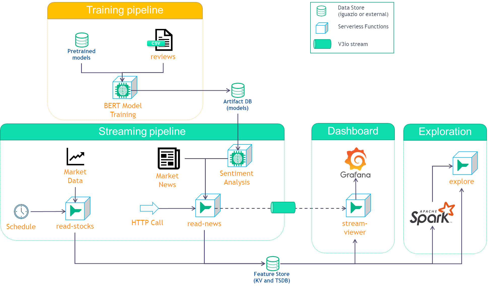

# Stocks Demo

A common requirement is to run your data engineering pipeline as part of the serving. This is often done by reading data from external data sources and generating insights using machine learning models.

This demo reads stock data, analyzes the related market news, and displays a dashboard of the data. The demo illustrates:

- The ease of deploying Python code to a scalable function (using Nuclio).
- Deploying and running an NLP model to perform Sentiment analysis.
- Integration with Iguazio’s Real-Time Multi-Model Data Layer.
- Leveraging machine-learning to generate insights.
- Processing streaming data to a user friendly dashboard.

The demo flow is as follows:

- read-stocks is executed at pre-defined intervals and reads stock data from a market data source. The latest stock data is updated in a key-value database and a time-series database is updated.
- read-news is executed per HTTP request, it reads market news related to the requested stock, and runs a model that analyzes the sentiment of that news item. The results are written to a v3io stream.
- stream-viewer reads the results from the stream, and combines the sentiment information with the stock data from the key-value database and the time-series database. This data is displayed in Grafana.

An optional training notebook creates the model and deploys it.
